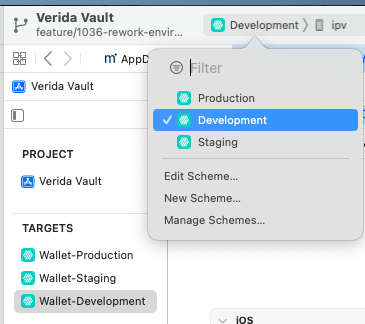
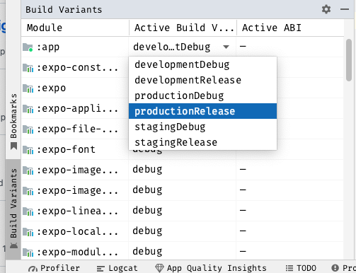

# Verida Wallet

## Requirements

Before you start, make sure you have installed:

- [Android Studio](https://developer.android.com/studio/index.html)(Latest version) : Android Dev Environment
- [Xcode](https://developer.apple.com/xcode/)(Latest version)
- [Node](https://nodejs.org) and [React Native CLI](http://facebook.github.io/react-native/docs/getting-started.html): React Native Dev Environment

### Good to have packages/tools

- [Xcodes](https://www.xcodes.app/): The easist way to install and manage multiple versions of Xcode
- [asdf](https://asdf-vm.com/): Manage all your runtime versions with one tool! (Node, Ruby, etc)

### Debugging Tools

- [Flipper](https://fbflipper.com/)

## Project Setup

### Environment variables

After cloning the repository, you can go to BitWarden and download the environment variable files `.env.development, .env.staging and .env.production` (you may not need `.env.production` it will likely be removed and moved to a more secure place). They are attached in the BitWarden secure note `Verida Wallet Environment Variables`, then place them inside the root project folder.

*** Note ***
To update the environment variables, you need to make changes to the environment files in the BitWarden secure note `Verida Wallet Environment Variables` and update them in BitRise (the CD environment) as well. Additionally, please notify the team to update their local machines to avoid any broken experience.

> If you're unsure how to do that, please contact a [__member of the team__](https://github.com/orgs/verida/people).

### Install dependencies and start developing

Recommend configuring local Ruby version using one of Ruby version manager tools like `asdf` or `rbenv` or `rvm` as your choice.
 
1. Run `bundle install` to install cocoapod(this is a one-time setup).
2. Run `yarn install` to install all the dependencies.
3. Run `yarn start` to reset the RN cache and launch the packager 

> **Info**
> 
> Running `yarn` executes `jetifier` for Android and `pod-install` for iOS.


## Notes

1. Due to the iOS keychain value max length being 2048 limitation, all the secure values need to save/load using our built-in VeridaSecureStore helper

## Integrate with client-rn

1. Make sure you are on the right branch of client-rn and verida-js
2. Run this command on your project's root directory:

`./scripts/integrate-client-rn.sh [verida-js path] [client-rn path]`

3. Terminate metro bundler process (if it's running) and run the app again.

<br/>

## Build and and Deploy applications manually

Below are instructions to build and deploy iOS and Android versions manually. Besides that, we already set up Bitrise as the automation build tool.

### Build and and Deploy iOS version using Xcode

1. **Select Scheme**: Open your Xcode project and click on the scheme dropdown in the top left corner. 
   - Choose "Development" for development and debugging.
   - Choose "Staging" for testing in a staging environment.
   - Choose "Production" for the production app build.

<br/>



2. **Select Target Device**: Next to the scheme dropdown, choose the target device (e.g., iPhone 14 Pro) you want to run the app on.

3. **Run the App**: Click the "Run" button (a triangle icon) or use the shortcut `Cmd+R`. Xcode will build and run the app with the selected configuration and device.

### Deploying the App:

1. **Prepare for Deployment**: Before deploying, ensure that you have configured the production flavor with all necessary production settings, such as API endpoints and keys.

2. **Set Scheme to Production**: In Xcode, choose the "Production" scheme as explained in the "Running the App" section.

3. **Build the App**: Navigate to "Product" in the top menu and select "Archive" This creates an app archive ready for distribution.

**Advance mode**: All of these actions can also be replaced with the equivalence commands using the command line interface


### Build and and Deploy Android version using Android Studio

#### Running the App:

1. **Select build variants**: Open your Android project in Android Studio.
   - In the "Build Variants" tab on the left side, choose `DevelopmentDebug/DevelopmentRelease` or `StagingDebug/StagingRelease` or `ProductionDebug/ProdutionRelease` as the target build variant.

<br/>



2. **Select Target Device**: Choose an emulator or physical device from the Android Virtual Device (AVD) manager or connect your Android device to your computer.

3. **Run the App**: Click the "Run" button (a green triangle icon) or use the shortcut `Shift + F10`. Android Studio will build and run the app with the selected flavor and device.

#### Deploying the App:

1. **Prepare for Deployment**: Before deploying, ensure that you have configured the production flavor with all necessary production settings, such as API endpoints and keys.

2. **Set Flavor to Production**: In the "Build Variants" tab, choose "StagingRelease" or `ProductionRelease` as explained in the "Running the App" section.

3. **Build the App**: Go to "Build" in the top menu and select "Build Bundle(s) / APK(s)," then choose "Build Bundle" or "Build APK(s)" based on your deployment method. This generates an APK file ready for distribution.

**Advance mode**: All of these actions can also be replaced with the equivalence commands using the command line interface


## Useful build commands

### To run in Android emulator

1. You should install `android studio`
2. `export ANDROID_HOME=/home/user/Android/Sdk` or specify `local.properties` file in `vault-mobile/android` dir with: `sdk.dir = /home/user/Android/Sdk`
3. `yarn start`
4. `react-native run-android --deviceId emulator-5554`

### To run app on your Android device

1. Put your android device in dev mode. Enable debug and installing app via usb.
2. Connect you phone and enable file transfer
3. Check if device is connected: `adb devices -l`
4. Run in terminal `lsusb` command and copy first 4 numbers of ID
   `Bus 001 Device 014: ID 2717:ff48`
5. Run `echo 'SUBSYSTEM=="usb", ATTR{idVendor}=="2717", MODE="0666", GROUP="plugdev"' | sudo tee /etc/udev/rules.d/51-android-usb.rules`
6. `yarn start`
7. `yarn run android`

## To generate a release Android build

1. Contact project manager to get the keystore file. The file name should be `verida-vault.keystore`
2. Paste the keystore file into `./android/app` folder
3. Set keystore password to global `gradle.properties` file:

```
cd ~/Users/[your_user_name]/.gradle
nano gradle.properties
```

Paste these 2 variables in

```
MYAPP_UPLOAD_STORE_PASSWORD=[your_password]
MYAPP_UPLOAD_KEY_PASSWORD=[your_password]
```

(Contact project manager to get`[your_password]`) 4. Run these commands:

```
cd android
./gradlew assembleStagingRelease
```

4. Get the APK generated in `./android/app/build`

## Instruction to get app running on Apple M1 macs

Prerequisites: you need to have node, watchman, etc installed, best to follow the setting up development environment instructions here for Mac and iOS and get a bare react native app working:
https://reactnative.dev/docs/environment-setup

To get started you will git clone the `vault-mobile` repo on your hard drive.

Next run `yarn` in the vault-mobile directory to install dependencies.

Next step is to navigate to `ios` directory and run `pod install`, this is where you will run into your first issue, this will fail.

To fix this you need to install `ffi`, run the following command:

`sudo arch -x86_64 gem install ffi`

Now install the pods using the following command:

`arch -x86_64 pod install`

source: https://stackoverflow.com/questions/64901180/running-cocoapods-on-apple-silicon-m1

Now if you try to run the project in xcode you will get about ~100 errors. to fix that you need to run xcode in rosetta mode, to do that go to your Mac's applications folder, find Xcode, right click, click "Get Info" and check the checkbox labeled 'Open using Rosetta'.

Now go into xcode, clean the build folder and run the app.

## How to use patch-package

For a case, we need to optimize PBKDF2 function, refer to this doc on the process and steps here [Optimize PBKDF2 function using react-native-fast-crypto and patch-package packages](https://www.notion.so/verida/Vault-Optimize-PBKDF2-function-using-react-native-fast-crypto-and-patch-package-packages-38d4eb736719409eac3fe8d2087a1836)
