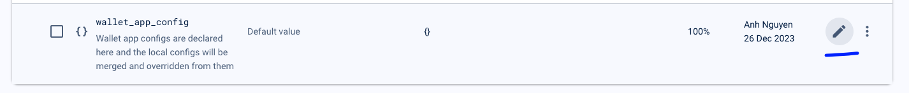
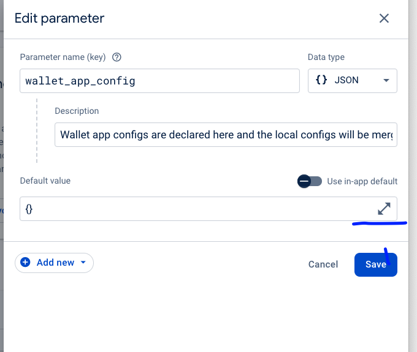
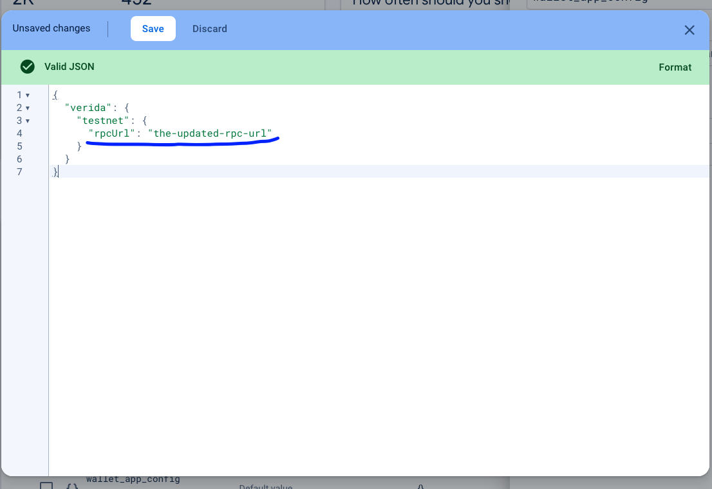
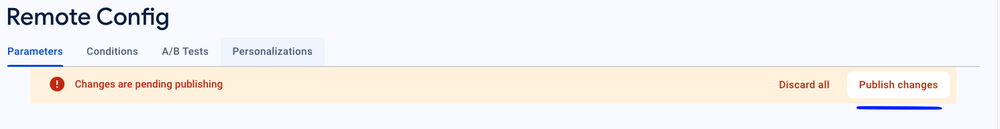

# Remote Config

# Usage

## Step 1

Get the shape of the current config object

```ts
console.log(JSON.stringify(config, null, 2))
```

Something like this log will be output to the console. Based on this we can update the properties of the configuration. Let's move to step 2.

```json
{
  ...
  "features": {
    "veridaMainnet": {
      ...
    },
    "home": {
      ...
    }
  },
  "verida": {
    "local": {
      ...
    },
    "devnet": {
      ...
    },
    "testnet": {
      ...
    },
    "mainnet": {
      ...
    }
  },
  "walletProvider": {
    ...
  },
  "dataConnector": {
    ...
  },
  "blockchain": {
    ...
  },
  "walletConnect": {
    ...
  },
  "polygonId": {
    "common": {
      ...
    },
    "testnet": {
      ...
    },
    "mainnet": {
      ...
    }
  }
}
```

## Step 2

Update Firebase remote config base on the shape of the config object at step 1
For example, if we need to update the Verida Testnet RPC we will need to update the Firebase remote config with these steps

> The change to be added

```json
{
  ...// Other configs
  "verida": {
    ...// Others configs for Verida
    "testnet": {
      "rpcUrl": "the-updated-rpc-url",
    }
  }
}
```

**Edit the app remote config on Firebase**

Firebase Remote Config https://console.firebase.google.com/project/verida-vault/config

> Select `wallet_app_config` item and edit it
> 

> Expand the JSON editor
> '

> Add the value for the updated Verida Testnet `rpcUrl` > 

> Save and publish changes
> 

Done, now the clients will get the config update for Verida Testnet `rpcURL` OTA
